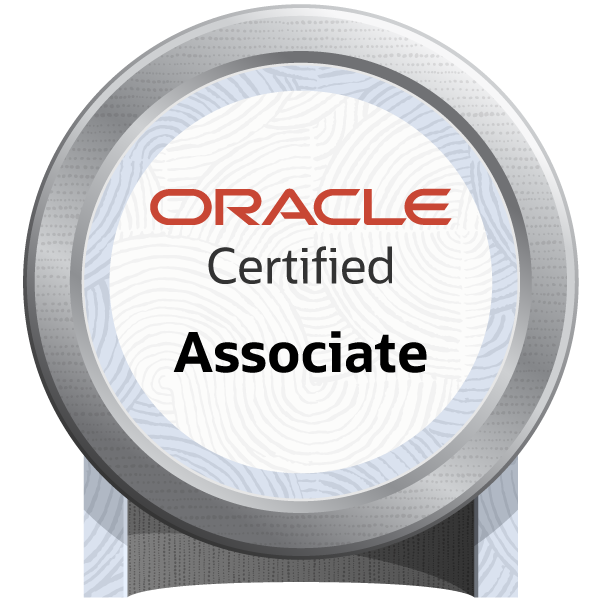

<h1>Hi there, I'm Hyobeom 👋</h1>

  <strong>Cloud Engineer & SRE (Site Reliability Engineer)</strong> 
  Building and operating scalable cloud infrastructure

 

## ☁️ About Me

- 🔧 **Cloud Engineer / SRE (Site Reliability Engineer)** focusing on infrastructure automation and reliability
- ☁️ Primarily working with **AWS** (design, build, operate)
- 🌐 Multi-cloud experience across **Azure**, **GCP**, **NHN Cloud**, **NCloud**
- 📐 Infrastructure as Code & container orchestration enthusiast

 

## 🛠️ Tech Stack

### Cloud Platforms

  
  
  
  
  

### Infrastructure & DevOps

  
  
  
  
  
  
  

### Collaboration

  
  
  
  
  

 

## 📜 Certifications

<table>
  <tr>
    <td align="center" width="20%">
       
      <b>AWS Certified</b> Solutions Architect – Professional
    </td>
    <td align="center" width="20%">
       
      <b>Microsoft Certified</b> Azure Administrator Associate
    </td>
    <td align="center" width="20%">
       
      <b>NAVER Cloud Platform</b> Certified Professional
    </td>
    <td align="center" width="20%">
       
      <b>Oracle</b> Certified Associate
    </td>
    <td align="center" width="20%">
       
      <b>Datadog Certified</b> DPN Technical Specialist
    </td>
  </tr>
</table>

 

## 📫 How to Reach Me

  
  

 
